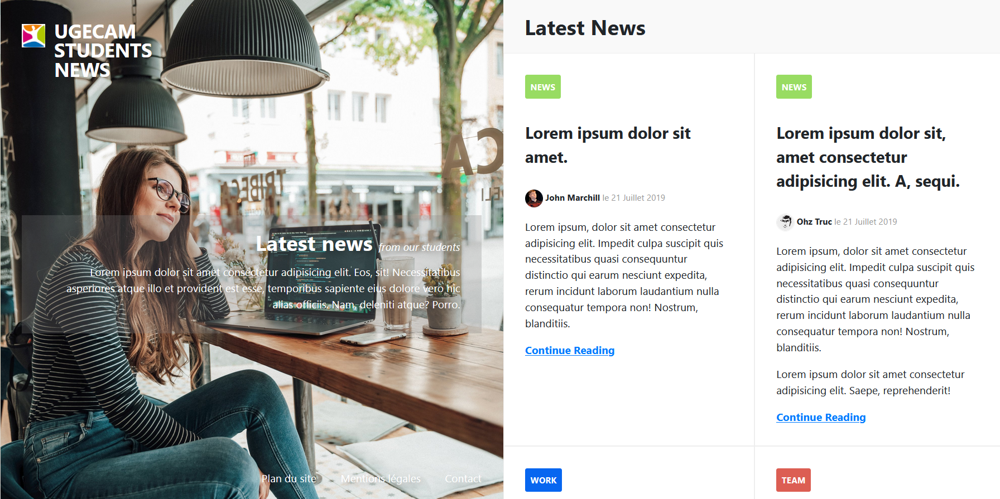

# Ugecam News

Ugecam sort son journal d'étudiants.

Votre mission, si vous l'acceptez (...pfff évidemment qu'on l'accepte ), sera d'intégrer la maquette du site.

*c'est beau, hein ?*
## Infos

- il y a 3 pages à monter
- il y a une scrollbar à droite, mais on en tient pas compte
- cette fois, on utilise `reboot.css` pour standardiser les styles par défaut des balises HTML
- pour voir les différentes possibilités pour standardiser :
  - https://codepen.io/ncerminara/pen/RLMwmy
  - changez de sélection dans le menu déroulant _None (Browser styles only)_
  - vous verrez les différences en 1 clin d'oeil :wink:
- vous aurez besoin de spécifier une couleur avec de la transparence => `rgba(0, 0, 255, 0.5)` par exemple pour du bleu à 50% d'opacité => https://cssreference.io/property/color/
- vous aurez peut-être besoin de dire à un élément de prendre 100% de la hauteur de la fenêtre => `height: 100vh;`
  - pour comprendre l'unité `vh`, [la doc sur les unités de mesures sur MDN](https://developer.mozilla.org/en-US/docs/Web/CSS/length)
- vous mettrez en place les pages "contact" et "mentions légales" sous la même forme. À gauche : on touche à rien, à droite : votre contenu (un formulaire de contact ou les mentions légales)
___
## Charte

### Visuels

Le dossier `images` contient tous les visuels nécessaires pour cette intégration.

_Ne vous préoccupez pas pour l'instant du contraste des textes sur l'image. Ça fera l'objet d'un bonus_

### Couleurs

- fond header : #f9f9f9
- bordure d'article : #eaeaea
- WORK : #0766F0;
- TEAM : #DC5E53;
- NEWS : #98DC62;

### Font

Choix libre mais de type sans-serif
___
## Informations additionnelles

- Les deux parties (portrait et grille d'articles) sont sur une seule et même page
- L'image de la partie de gauche touche les bords supérieur, inférieur et gauche du navigateur, mais n'aura pas la même apparence selon la largeur de chaque écran. Tant qu'elle touche les bords, n'est pas déformée et prend la moitié de la page, c'est que c'est bon ; même si elle se retrouve un peu rognée verticalement.
- n'oubliez pas de mettre un effet lors du survol des liens par la souris :wink:
- si possible, placer le logo Ugecam en background
___
## Git

- il ne faut pas oublier d'enregistrer ses modifications (versions) avec **git**
- **créez un repos** sur l'espace commun que vous appelerez **"ugecam-news-votre-nom"**, et mettez le en **privé**, il me tarde de pouvoir regarder vos progrès depuis toutes ces semaines...
- il est préférable de faire un *commit* à chaque fonctionnalité terminée (par exemple, une fois la partie de gauche terminée => sauvegarde)
- rappel des commandes **git** :
  - `git add .` pour ajouter tous les fichiers ajoutés/modifiés au prochain commit
  - `git commit -m "message explicite expliquant les modifs effectuées"` pour sauvegarder la version actuelle des fichiers sources
  - `git push` pour envoyer tout ça vers votre repo
___
## Bonus "lisibilité" :white_flower:

Si vous avez lu tout l'énoncé, vous savez ce qu'il vous reste à faire ;-)
- Trouvez les propriétés et valeurs CSS idéales pour que le cadre transparent derrière le texte central bouge harmonieusement lorsque vous modifiez la taille de la fenêtre
- Identifiez un moyen de faire ressortir les liens en bas de la page sur le fond clair
___
## Super-bonus "défilement"

- il y a une scrollbar à droite, et désormais on en tient compte :boom:
- la page contient en tout 6 articles, même si seuls 4 sont visibles
- lorsqu'on fait défiler la page pour voir les 2 articles suivants :
  - la partie de gauche ne bouge pas, elle reste figée
  - le scroll fait descendre la partie droite et affiche les 2 articles suivants
___
## Super-méga-bonus-de-la-mort
Vous en voulez encore ?
Créez les pages qui s'afficheront quand on cliquera sur "continue reading"... On garde encore le côté gauche intact, mais à droite on aura l'article dans son intégralité.